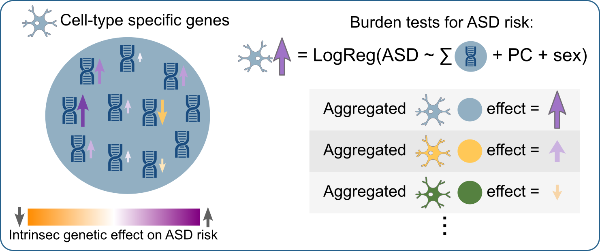

# FunBurd


## Description
Compute the functional burden of a biological function for a phenotype.

## How to install:

1. **Clone the Repository**:
   ```bash
   git clone https://github.com/JacquemontLab/FunBurd.git
   cd FunBurd
   ```

2. **Create a Virtual Environment (Optional but Recommended)**:
   ```bash
   python -m venv venv
   source venv/bin/activate  # On Windows use `venv\Scripts\activate`
   ```

3. **Install the Required Dependencies**:
   ```bash
   pip install -r requirements.txt
   ```

4. **Install the Module**:
   ```bash
   pip install .
   ```

## Dependencies

The module requires the following dependencies:
- Python 3.8 or higher
- pandas
- numpy
- scipy
- statsmodels

These dependencies will be automatically installed when you run `pip install -r requirements.txt`.

## Usage

After installation, you can import the module in your Python scripts:
```python
import FunBurd
```

## Functions

### Function Documentation: `FunBurd_one_gene_set`

#### Description
The `FunBurd_one_gene_set` function performs a burden analysis for a single gene set. It takes phenotype and variant data, collapses the variants into gene sets, and runs a regression model to assess the association between the gene burden and the phenotype. The function can handle both continuous and binary phenotypes and allows for the inclusion of covariates and interaction terms.

```python
FunBurd_one_gene_set(phenotype_table: pd.DataFrame,
                         phenotype_column_name: str,
                         variants_table: pd.DataFrame,
                         gene_list: list,
                         keep_all_regression_results: bool = False,
                         list_covariantes: list = None,
                         interaction_column: list = None,
                         column_for_conditional: str = None,
                         correction_outside_gene_set: dict = None)
```

#### Parameters
   Parameter | Type | Description | Default |
 |-----------|------|-------------|---------|
 | `phenotype_table` | `pd.DataFrame` | DataFrame containing the phenotypical data of each individual (See input example for mandatory columns). | |
 | `phenotype_column_name` | `str` | Name of the column in the phenotype table that contains the phenotype scores, can be either binary or continous scores, FunBurd will run accordingly. | |
 | `variants_table` | `pd.DataFrame` | DataFrame containing the variants altering each gene for each individual of the analysis. (See input example for mandatory columns) | |
 | `gene_list` | `list` | List of genes to collapse as a unique functional group and used for the burden analysis. | |
 | `keep_all_regression_results` | `bool` | If `False`, will only keep the results of the regression model for the gene burden. If `True`, will keep all the results of the regression model (including covariates and interactions terms). | `False` |
 | `list_covariantes` | `list` | List of covariates to include in the regression model in addition to the gene burden. | `None` |
 | `interaction_column` | `list` | List of columns for interaction terms in the regression model. | `None` |
 | `column_for_conditional` | `str` | Column name for conditional analysis. To use if the individuals are part of same families for example. | `None` |
 | `correction_outside_gene_set` | `dict` | To use if you want to correct the burden results based on the rest of the genome outside of the studied functional set of genes. Dictionary containing the categories of the genes in the genome for correction outside the gene set. (See input example for more details) | `None` |

#### Returns
 | Type | Description |
 |------|-------------|
 | `pd.DataFrame` | DataFrame containing the results of the burden analysis with each line representing a covariate association with the phenotype. |


## Example of input data


#### Individual's genotyping dataframe

  SampleID | Gene | Variant_Type |
 | - | - | - |
 | Sample0 | ENSG00000132549 | Splice_variants |
 | Sample0 | ENSG00000167548 | Missense |
 | Sample0 | ENSG00000182359 | Missense |
 | Sample0 | ENSG00000165474 | Stop_Gained |
 | Sample1 | ENSG00000164303 | Missense |
 | Sample1 | ENSG00000010626 | Splice_variants |
 | Sample1 | ENSG00000112559 | Missense |
 | Sample1 | ENSG00000139144 | Stop_Gained |
 | Sample1 | ENSG00000131016 | Missense |
 | Sample1 | ENSG00000157800 | Missense |
 | Sample1 | ENSG00000134313 | Missense |
 | Sample2 | ENSG00000102763 | Missense |

#### Individual's phenotyping dataframe

SampleID | FID | Phenotype | Covariate1 | Covariate2 |
 | - | - | - | - | - |
 | Sample0 | 16 | 0 | -0.0023 | -0.0189 |
 | Sample1 | 16 | 1 | -0.0021 | -0.0204 |
 | Sample2 | 21 | 0 | -0.001 | -0.02 |

 **Mandatory Columns:** 
 - SampleID, has to be this name and same individual ID as the genotyping dataframe
 - Phenotype, column name can be anything, just indicate the column name in the function. Data have to be numerical (either binary or continuous).

**Other columns:**
Any other column can be used as covariate or interaction in the model, if the data type is numerical. 

#### Dictionnary of gene categories for correction
